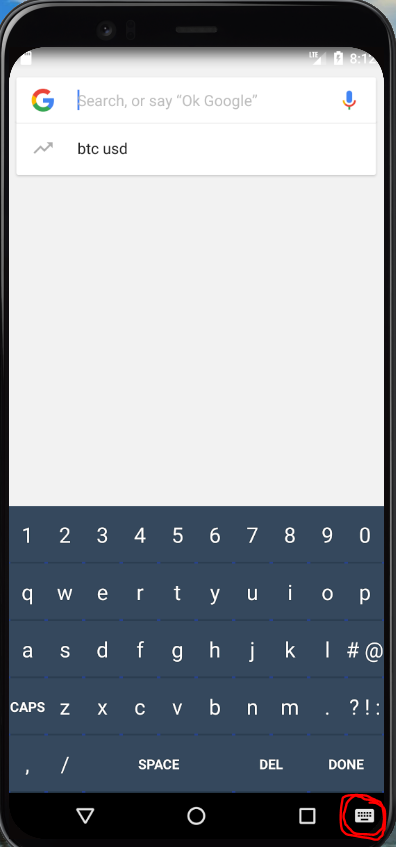
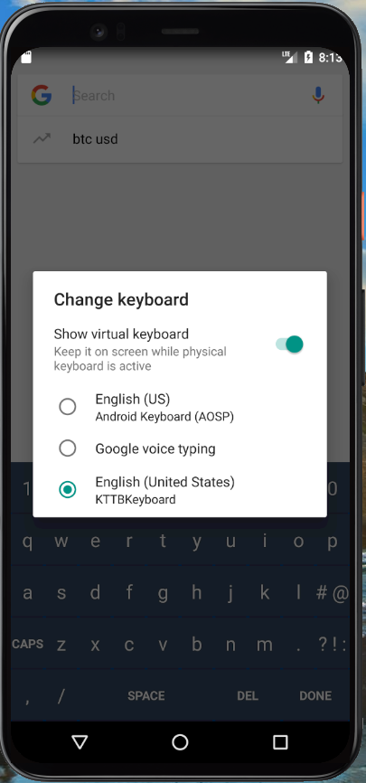
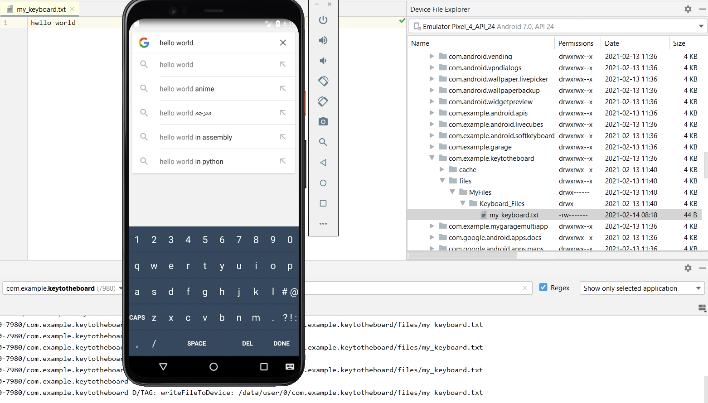

# KeyToTheBoard
## My Custome keyboard with suprise

## Explanation
Hello everyone!

This is a custom keyboard that i build in Mobile Security course.

Hope you will enjoy it

Good Luck

## Setup
1. Download this project to your android studio and run it.

2. Go to Settings to enable the custome keyboard

3. Change your keyboard to KTTB

**Comment to Guy/Tom**
This keyboard have a little suprise for you guys.

Look on this answer

*https://stackoverflow.com/questions/61169547/cant-find-the-saved-data-to-text-file-in-internal-storage-how-to-save-file-in-i*

Hope you enjoy.

Thanks.
